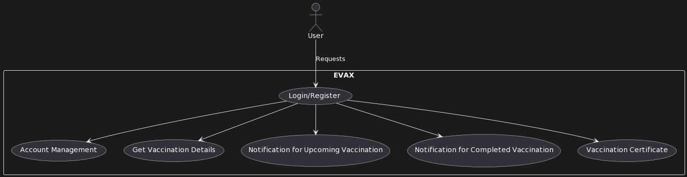
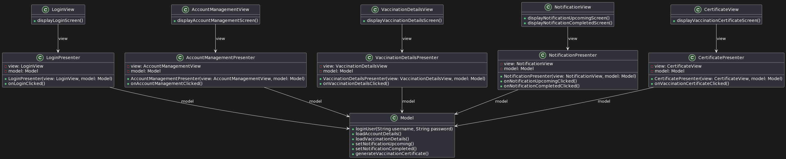
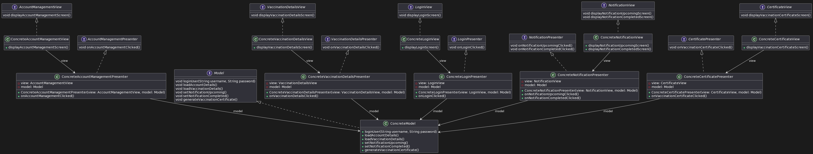
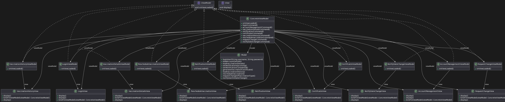

# Lab2 - MV* Architectures 

> Presented By: **Oussema Jaouadi**  
> Link to the lab: [Lab2](https://insatunisia.github.io/TP-ArchLog/tp2/)

## MV* Architectures

A little comparative table between the different MV* architectures:

| MVC | MVP | MVVM |
| --- | --- | --- |
| Model-View-Controller | Model-View-Presenter | Model-View-ViewModel |
| One of the oldest architectures | Developed as the second iteration of software architecture which is advance from MVC. | Industry-recognized architecture pattern for applications. |
| UI(View) and data-access mechanism(Model) are tightly coupled.| It resolves the problem of having a dependent View by using Presenter as a communication channel between Model and View. | This architecture pattern is more event-driven as it uses data binding and thus makes easy separation of core business logic from the View.|
|Controller and View exist with the one-to-many relationship. One Controller can select a different View based upon required operation.| The one-to-one relationship exists between Presenter and View as one Presenter class manages one View at a time. | Multiple View can be mapped with a single ViewModel and thus, the one-to-many relationship exists between View and ViewModel.|
| The View has no knowledge about the Controller. | The view has references to the Presenter. | The View has references to the ViewModel. |

But the more important comparison consists of this table:

| MVC | MVP | MVVM |
| --- | --- | --- |
| Difficult to make changes and modify the app features as the code layers are tightly coupled.	| Code layers are loosely coupled and thus it is easy to carry out modifications/changes in the application code. |  Easy to make changes in the application. However, if data binding logic is too complex, it will be a little harder to debug the application. |
| Ideal for small scale projects only.	| Ideal for simple and complex applications. | Ideal for large scale projects. |
| Limited support to Unit testing.| Easy to carry out Unit testing but a tight bond of View and Presenter can make it slightly difficult.| Unit testability is highest in this architecture. |
| It does not follow the modular and single responsibility principle.| It follows the modular and single responsibility principle.| It follows the modular and single responsibility principle. |

## The hackathon scenario 

### Choosing the architecture and why ? 

In a hackathon, the time is very limited (24h generally) , thus we need to be very efficient and productive.

Ideally we choose MVVM if we are working in a large enterprise, but in a hackathon we need to be very fast and productive, so we choose MVP or MVC .

The MVC influences too much depancies as the team members will sometimes have too much time wasted coodepending on one another :-1:

The MVP solves this issue as it seperated the controllers from the views, thus the team members can work on their own without depending on one another :+1:

Besides we want a perfection to win thus we need to test our code, and the MVP is the best architecture for testing :+1:

For the hackathon the fonctionalities are not to much complex so we will not face an issue building to much presenters ( for now xD ) .

### Functionalities and diagrams 

The hackathon is about a mobile app for EVAX plateform, the app will have the following functionalities:

- Login and register
- Account management ( edit profile, change password, delete account )
- Get vaccination details ( date,time,place,type of vaccine )
- Get notification when the vaccination date is near
- Get notification when the vaccination date is done
- Get vaccination certificate

The app will have the following diagrams:

- [Use case diagram](/diagrams/hackathon_usecase.puml) : 

All that said let's jump to the implementation of the application , we will follow that [architecture](./diagrams/hackathon_simplified.puml):

### Note 

I'm not really a mobile developper and I don't know if we implement directly our classes in mobile development or we use interfaces and then implement them , if the second case is true then we will have to add interfaces to our classes and follow this [diagram](./diagrams/hackathon_complete.puml) :

## To professional startup 

### Choosing the architecture and why ?

Now we won the hackathon and we want to make a startup out of it, we will need to add more functionalities and make the app more complex.

In this case we can't use the MVP as it will be very hard to maintain and test the code, we will need to use MVVM : many presenters and many views , the build we take many resources and it will cost too much to deploy and if we wanted a high availability we will be doomed :scream:

When we want to start a startup we will have a good time to build the app so we will merge what done so far and we merge to the MVVM architecture.

After merging and retesing we can have an application less resource consuming and more maintainable and the future functionalities will be easier to implement and test 😺

### Functionalities and diagrams

We will add the following functionalities:
- Get the vaccination history
- Reschedule the vaccination date
- Request change of vaccination type
- Notify the user when the vaccination date is changed

The app will have the following [diagram](./diagrams/startup_usecase.puml):

So for the application we will have this [architecture](./diagrams/startup_complete.puml): 

